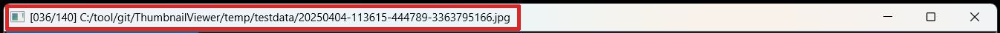

## ThumbnailViewerについて 0.2.9
画像を大き目のサムネイルで表示し「フォルダ振り分けに特化」したツールです  
マウスやキーボードで軽快に片手で振り分けできます  

## 特徴
- 大き目のサムネイル表示（128-512dotまで変更可能）
- マウスもしくはキーボードだけで2つのフォルダに振り分け
- フォルダ振り分けしたファイルはサムネイル表示画面でバッジとして表示
- webpの再生にも対応（画像表示時）
- キーボードでは削除も可能

## インストール方法（簡易）
[簡易インストール版zipのダウンロード]  
    https://github.com/nekotodance/ThumbnailViewer/releases/download/latest/ThumbnailViewer.zip  

- Pythonのインストール（SD標準の3.10.6推奨）
- zipファイルを解凍
- 解凍したフォルダ内の「tv-install.ps1」を右クリックして「PowerShellで実行」を選択
> [!WARNING]
> シェルスクリプトはデフォルトでは動作しない設定となっています  
> その場合はターミナルを管理者として実行し、以下のコマンドを実行してください（比較的安全な方式）  
> Set-ExecutionPolicy Unrestricted -Scope CurrentUser -Force

- イントールの最後にデスクトップにリンクをコピーするかどうかを聞いてきます  
「"Do you want to copy the shortcut to your desktop? (y or enter/n)」  
必要があれば「y」入力後、もしくはそのまま「enter」キー  
必要なければ「n」入力後「enter」キー  
- ThumbnailViewerリンクが作成されます  

## インストール方法（手動）
- Pythonのインストール（SD標準の3.10.6推奨）  
- gitのインストール  
- gitでリポジトリを取得  
`git clone https://github.com/nekotodance/ThumbnailViewer`
- 必要なライブラリ（0.2.0でsend2trashを追加）  
`pip install PyQt5 Pillow send2trash`
- 実行方法  
`Python ThumbnailViewer.py`

## 設定ファイルについて
一度起動すると作成されるThumbnailViewer_settings.jsonに設定値を保存しています  
- コピー、ムーブ先のディレクトリ設定  
  - image-fcopy-dir1   : コピー先フォルダ1  
  - image-fcopy-dir2   : コピー先フォルダ2  
> [!CAUTION]
> image-fcopy-dir1、image-fcopy-dir2は【自分の環境に合わせて必ず】書き換えてください！  
> またパスの区切り文字はWindowsの「W:\\_temp\\ai」ではなく「W:/_temp/ai」として記載してください  

- 外部アプリの起動設定  
  - start-exe-app-name    : 外部アプリのファイル名
  - start-exe-python-name : Pythonを起動する場合のPythonファイル名
  - start-exe-work-dir    : 外部アプリ実行時のワーキングディレクトリ
> [!TIP]
> 以下に設定例を記載します
> - 特定のアプリを起動する場合  
>   - start-exe-app-name = "C:/Program Files/Honeyview/Honeyview.exe"  
>   - start-exe-python-name = "" ※なにか特別な引数が必要なアプリであればここに記載すれば動くかも？  
>   - start-exe-work-dir = "" ※必要に応じて  
> - 別のvenvありのPythonファイルを起動する場合（初期値）[^1]  
>   - start-exe-app-name = "C:/tool/git/PromptViewer/venv/Scripts/pythonw.exe"  
>   - start-exe-python-name = "C:/tool/git/PromptViewer/PromptViewer.py"  
>   - start-exe-work-dir = "C:/tool/git/PromptViewer"  

## 利用方法
アプリ上に画像ファイルもしくはフォルダをドラッグ＆ドロップするとサムネイル表示されます  
※対処方法検討中：相当大量の画像をドロップした後、サムネイルの作成が完了するよりも先に別の大量の画像をドロップすると処理が重くなるもしくは落ちる可能性あり  

単体ファイルの場合：同じ階層の画像を表示  
複数ファイルの場合：ドロップした画像だけを表示  
単体フォルダの場合：ドロップフォルダ内の画像を表示  
複数フォルダの場合：ドロップした全てのフォルダ内の画像を表示  

## 操作方法
基本的にはサムネイルを表示している状態で操作し、たまに詳細が気になるものだけ拡大して確認するような使い方を想定しています  
- マウスのホイールでスクロールし右クリックで別フォルダにコピー  
- キーボードのWASDで画像を選択し、Eキーで別フォルダにコピー  
- 少し詳細が気になる画像があればFキーか左ダブルクリックで画像表示  
- 画像表示中でもWASDやマウスホイール、Eキーや右クリックも可能  

#### 状態問わず共通の操作
- 上下左右カーソルキーで選択画像を移動  
- PageUp,2,PageDown,Xキーで1ページ分[^2]スクロール  
- E、「/」キー、マウスの右クリックで選択画像をコピー先フォルダ1にコピー  
- Q、「.」キー、マウスの中クリックで選択画像をコピー先フォルダ2にコピー  
- H、DELETEキーで選択ファイルを削除  
- ESC、「,」キーでアプリ終了  
- R、Pキーで外部アプリにて画像を開く[^1]  
- F8,F9,F10キーで現在のアイコン・ウインドウサイズを保存[^3]  
- 8,9,0キーで保存したアイコン・ウインドウサイズに切替[^3]  

#### サムネイルリストの場合
- マウスホイールでキーボードの上下キー相当の動作  
- F、ENTERキー、マウスの左ダブルクリックで選択画像を表示  

#### 画像表示の場合
- マウスホイールでキーボードの左右キー相当の動作  
- マウスの左クリックを含む、共通操作のキー以外でサムネイルリストに戻る  

#### サムネイルサイズの設定
画面右下のステータスバー領域に存在するボタンとスピンボックスでサムネイルサイズを変更できます  
- 最小128dotから最大512dotまで設定可能  
- -64、+64ボタンによる変更の他、スピンボックスへの直接入力などが可能  
- 変更したサイズにはsetボタンにより反映（ただしサムネイル作成中はsetボタン無効）  
  

## 画面の表示内容
#### ウインドウタイトル部分
選択、表示している画像が全ファイル中の何ファイル目か、またフルパスのファイル名を表示します  
- [x/y] [ファイル名フルパス]  
    - x:現在選択中、もしくは表示中の画像番号  
    - y:ファイル総数  
  

#### アイコン部分
画像のサムネイル表示とその他情報を表示します  
- アイコンの左上と右上にコピー先フォルダに画像ファイルが存在するかどうかのバッジ  
- アイコンの下に先頭8文字と終端部分を除き省略したファイル名と、画像サイズ  
    - アイコンサイズが128dotの場合は、<先頭8文字>..<終端6文字>  
    - アイコンサイズが512dotの場合は、<先頭8文字>..<終端54文字>  
  

#### ステータスバー左下部分
何ファイルがドロップされたか、またコピーや削除処理の結果を表示します  
  

#### ステータスバー右下部分
サムネイル作成状況を表示します  
- Thumbnail created [x/y]  
    - x:サムネイル作成が完了したファイル数  
    - y:ファイル総数  
  

## その他
#### キーカスタマイズ
> [!TIP]
> キー割り当てを変更したい場合、ThumbnailViewer.pyの先頭近くにある「キー割り当ての変更」部分を編集してください  

#### リストでのマウスによる画像表示
> [!TIP]
> デフォルトでは左ダブルクリックで画像表示になっています  
> 左シングルクリックに戻したい場合、ThumbnailViewer.pyの先頭近くにある「DEF_MOUSE_DOUBLECLICK_IS_ON = True」をFalseに変更してください  

#### ファイルやフォルダドロップ時の初回動作について
> [!TIP]
> HDDを利用している、もしくは一度に数千枚の画像の振り分けをされる方はThumbnailViewer.pyの先頭近くにある  
> 「DEF_CHECK_BADGE_IS_ON = True」をFalseに変更すると多少軽くなります  
> ただし、初回動作時にコピー先フォルダに既にファイルが存在するかのチェックが行われませんので、実際にコピー操作を行うまでバッジは表示されません  

## 注意事項
- jpg,png,webpあたりでしか動作確認していません（ソース上はpng,jpg,jpeg,bmp,gif,webpに対応）  
- 厳密なファイルチェックはしていないので気をつけてください（例えばとてつもなく大きいサイズなど）  
- ※対処方法検討中：相当大量の画像をドロップした後、サムネイルの作成が完了するよりも先に別の大量の画像をドロップすると処理が重くなるもしくは落ちる可能性あり  

## 変更履歴
- 0.2.9 アイコン・ウインドウサイズの登録機能追加  
- 0.2.8 選択項目が外れるケースに対処  
- 0.2.7 状況表示の位置を調整  
- 0.2.6 マウスの右ボタンダブルクリックは無効化、他  
- 0.2.5 マウスでの画像表示をダブルクリックに変更、他  
- 0.2.4 カーソルキー移動バグ修正  
- 0.2.3 外部アプリ起動追加、他  
- 0.2.2 表示上のバグ修正、アイコン変更、他  
- 0.2.1 ファイル削除時の不具合対応  
- 0.2.0 バッジ表示機能、ファイル削除、PageUp/Down追加、他（！使用するライブラリが増えています！）  
- 0.1.1 Webp,gif再生に対応、左クリック動作の変更、画像表示サイズの修正、他  
- 0.1.0 初版  

[^1]:外部アプリ起動の設定例  
良く分からない方は初期値のままで、PromptViewerをC:/tool/git/PromptViewerに簡易インストールしていただければ動作します  
https://github.com/nekotodance/PromptViewer  

[^2]:1ページ分の扱い  
まるまる1画面分スクロールするのではなくて、1行分だけ前の画面の行が残ります  
（現在3行分サムネイルが表示されている場合は2行分スクロールします）  
もし1行分未満しか表示されていない場合は上下キーと同じ動作となります  

[^3]:アイコン・ウインドウサイズの登録機能  
8,9,0を押して初期値の動作を見ていただければ分かりますが、好みのアイコンサイズにジャストフィットするウインドウサイズを保持しておくための機能となります（ディスプレイのカスタムスケーリングによって多少変わるかも知れません）  
8キー : アイコンサイズ128dotで10列5行  
9キー : アイコンサイズ256dotで7列3行  
0キー : アイコンサイズ320dotで5列3行  
F8,F9,F10で更新できますので、お好みのサイズにスパッと切り替えられるようになります  
ただし切替はサムネイルの作成が完了しないと行えないようにしています（※対処方法検討中の問題と同様）  
リスクが気にならない方はload_okini_size()の先頭のガード処理をコメントアウトしてください  
設定ファイルのdic-okini-sizeに保存していますので、ドット単位での修正も可能です  